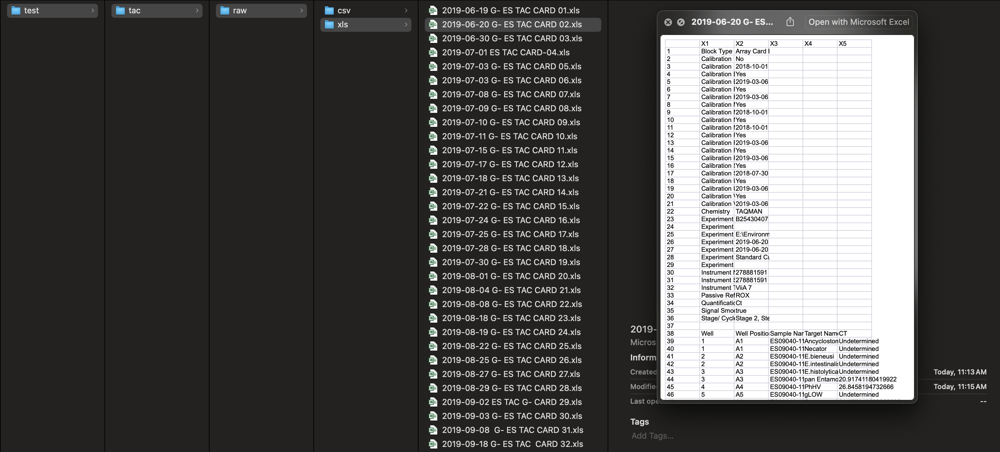

```{r include=FALSE}
knitr::opts_chunk$set(collapse = TRUE,
                      comment = "#>")
```

### Install package
```{r, eval=FALSE}
install.packages('devtools')
devtools::install_github('gilesjohnr/es.dhaka', dependencies=TRUE)
library(es.dhaka)
```

### Parse card level TAC data
```{r, eval=FALSE}
root <- '{path to Dropbox}/ES TAC/'

paths_xls <- c(
     file.path(root, "BEED TAC/EXCEL"),
     file.path(root, "ES080217432 - ES090317455 TAC Cards/Excel"),
     file.path(root, "G- TAC Cards for Polio ES/Excel"),
     file.path(root, "Qadri Enteric TAC/EXCEL"),
     file.path(root, "KEPS TAC/EXCEL")
)

parse_tac_xls(path_in = paths_xls,
              path_out = "./test/tac",
              verbose = TRUE)

[==============================================] 100% | Elapsed: 00:01:16 | Remaining:  0s

Input .xls files: 312
Parsed .csv files: 305
Output here: /Users/johngiles/test/tac/raw/csv
Warning messages:
1: In parse_tac_xls(path_in = paths_xls, path_out = "./test/tac",  :
  File exclude due to >1 sheet: 
./Qadri Enteric TAC/EXCEL/2022-04-03 ES QADRI ENTERIC CARD 111.xls
2: In parse_tac_xls(path_in = paths_xls, path_out = "./test/tac",  :
  File exclude due to >1 sheet: 
./Qadri Enteric TAC/EXCEL/2022-04-05 ES QADRI ENTERIC CARD 112.xls
3: In parse_tac_xls(path_in = paths_xls, path_out = "./test/tac",  :
  File exclude due to >1 sheet: 
./Qadri Enteric TAC/EXCEL/2022-04-06 ES QADRI ENTERIC CARD 113.xls
4: In parse_tac_xls(path_in = paths_xls, path_out = "./test/tac",  :
  File exclude due to >1 sheet: 
./KEPS TAC/EXCEL/2023-06-06 KEPS CARD for QADRI ENTERIC CARD 27.xls
5: In parse_tac_xls(path_in = paths_xls, path_out = "./test/tac",  :
  File exclude due to >1 sheet: 
./KEPS TAC/EXCEL/2023-06-09_KEPS_Std1.xls
6: In parse_tac_xls(path_in = paths_xls, path_out = "./test/tac",  :
  File exclude due to >1 sheet: 
./KEPS TAC/EXCEL/2023-06-09_KEPS_Std2.xls
7: In parse_tac_xls(path_in = paths_xls, path_out = "./test/tac",  :
  File exclude due to >1 sheet: 
./KEPS TAC/EXCEL/2023-06-09_KEPS_Std3.xls
```

Output includes the original .xls files:
```{r out.width = '90%', echo = FALSE}

```

And reconfigured .csv files containing the raw data:
```{r out.width = '90%', echo = FALSE}

```

### Compile TAC data

Compiling card-level .csv files into a single data set requires the `key_target_names` data dictionary shown here:
```{r, eval=FALSE}
head(es.dhaka::key_target_names)

  target_name_unique target_name_concise control include
1                18S                 18S      NA       1
2   Adenovirus 40/41    Adenovirus_40_41    PhHV       1
4   Adenovirus_40_41    Adenovirus_40_41    PhHV       1
5   Adenovirus_40-41    Adenovirus_40_41    PhHV       1
3     Adenovirus pan      Adenovirus_pan    PhHV       1
6          Aeromonas           Aeromonas    PhHV       1
```

Multiple QC steps are performed during compilation:
```{r, eval=FALSE}
compile_tac_data(path_in = "./test/tac/raw/csv",
                 path_out = "./test/tac",
                 key = es.dhaka::key_target_names,
                 tau = 40,
                 verbose = TRUE)

Precheck .csv files
Loading .csv files
Removing excluded targets
Fixing duplicated target names
[==============================================] 100% | Elapsed: 00:02:04 | Remaining:  0s

Editing ct_value responses based on contamination controls
Samples blanks with contaminated observations: 90
 [1] "BLANK 17.06.2019" "BLANK 24.06.2019" "BLANK 27.06.2019" "BLANK 03.07.2019"
 [5] "BLANK 07.07.2019" "BLANK 10.07.2019" "BLANK 17.07.2019" "BLANK 23.07.2019"
 [9] "Blank 18.08.2019" "BLANK 01.09.2019" "BLANK 08.09.19"   "Blank 15.09.19"  
[13] "blank 1.10.2019"  "BLANK 19.12.12"   "BLANK 03.02.20"   "BLANK 13.05.20"  
[17] "BLANK 08.11.2020" "Blank 16.11.20"   "Blank 24.11.20"   "Blank 06.12.2020"
[21] "BLANK 14.12.20"   "Blank 20.12.20"   "BLANK 29.12.2020" "Blank 03.01.2021"
[25] "BLANK 12.01.2021" "BLANK 17.01.2021" "BLANK 24.01.2021" "Blank 28.01.2021"
[29] "BLANK 04.02.2021" "Blank 09.02.2021" "BLANK 15.02.2021" "BLANK 18.02.2020"
[33] "BLANK 23.02.2021" "Blank-01032021"   "Blank 07.03.2021" "BLANK 11.03.2021"
[37] "BLANK 16.03.21"   "Blank 23.03.21"   "Blank 28.03.2021" "Blank 05.04.2021"
[41] "Blank 11.04.2021" "BLANK 13.04.2021" "BLANK 22.04.2021" "BLANK 25.04.2021"
[45] "BLANK 08.05.2021" "BLANK 05.05.2021" "Blank 11.05.2021" "BLANK 25.05.2021"
[49] "Blank 27.05.2021" "Blank 02.06.2021" "BLANK 10.06.2021" "Blank 15.06.2021"
[53] "Blank 21.06.2021" "Blank 28.06.2021" "Blank-5.6.2021"   "Blank 07.07.2021"
[57] "Blank 15.07.2021" "BLANK 20.07.2021" "Blank 27.07.2021" "Blank-02.08.2021"
[61] "BLANK 03.08.2021" "BLANK 04.08.2021" "BLANK 09.08.2021" "Blank 18.08.2021"
[65] "BLANK 22.08.2021" "BLANK 25.08.2022" "BLANK 30.08.2021" "BLANK 01.09.2021"
[69] "BLANK 08.09.2021" "BLANK 16.09.2021" "BLANK 19.09.2021" "BLANK 26.09.2021"
[73] "BLANK 29.09.2021" "Blank 04.10.2021" "BLANK 10.10.2021" "BLANK 17.10.2022"
[77] "Blank 21.10.2021" "Blank 27.10.2021" "Blank 01.11.2021" "Blank 07.11.2021"
[81] "Blank 11.11.2021" "BLANK 17.11.2021" "BLANK 21.11.2021" "Blank 28.11.22"  
[85] "Blank 01.12.2021" "BLANK 08.12.2021" "BLANK 12.12.2021" "BLANK 20.12.21"  
[89] "BLANK 26.10.2021" "Blank 02.01.2022"
Number observations removed due to contaminated blanks: 445

              18S       Ancylostoma       Campy_cpn60 Campylobacter_16S 
               21                 2                 2                 1 
Campylobacter_pan      Enterobacter     Hs99999901_s1    M_tuberculosis 
                4                13                62                 1 
            MS2_1             MS2_2            pan_PV            PhHV_1 
              153                16                 2               147 
           PhHV_2     Shigella_EIEC     Strongyloides 
               19                 1                 1 
Editing ct_value responses based on amplification controls
[==============================================] 100% | Elapsed: 00:13:58 | Remaining:  0s

Cleaning up remaining 'Undetermined' observations
Parsing sample id
Final data:
'data.frame':	153652 obs. of  10 variables:
 $ experiment_name   : chr  "G- ES TAC CARD 01" "G- ES TAC CARD 01" "G- ES TAC CARD 01" "G- ES TAC CARD 01" ...
 $ experiment_barcode: chr  "B25430408" "B25430408" "B25430408" "B25430408" ...
 $ experiment_date   : IDate, format: "2019-06-19" "2019-06-19" ...
 $ well              : int  1 1 2 2 3 3 4 5 6 7 ...
 $ well_position     : chr  "A1" "A1" "A2" "A2" ...
 $ sample_id         : chr  "ES08010-09JUN19-ES080101001-ES_TNA-217283-" "ES08010-09JUN19-ES080101001-ES_TNA-217283-" "ES08010-09JUN19-ES080101001-ES_TNA-217283-" "ES08010-09JUN19-ES080101001-ES_TNA-217283-" ...
 $ sample_date       : Date, format: "2019-06-09" "2019-06-09" ...
 $ aquaprobe_id      : chr  "ES080101001" "ES080101001" "ES080101001" "ES080101001" ...
 $ target_name       : chr  "Ancylostoma" "Necator" "E_bieneusi" "E_intestinalis" ...
 $ ct_value          : num  40 40 40 40 31.1 ...
Compiled TAC data is here: /Users/johngiles/tests/test/tac/compiled_tac.csv
```

### Parse Aquaprobe data
```{r, eval=FALSE}
root <- '{path to Dropbox}/ES TAC/'

paths_aqua <- c(
     file.path(root, "TAC final QC MT/Aquaprobe/COVID-19 AQUAPROBE & WATER COLLECTION DATA.xlsx"),
     file.path(root, "TAC final QC MT/Aquaprobe/AQUAPROBE2.xlsx"),
     file.path(root, "TAC final QC MT/Aquaprobe/Missing AquaProbe Data.xlsx")
)

parse_aquaprobe_xlsx(
     path_in = paths_aqua,
     path_out = "./test/aqua"
)

./TAC final QC MT/Aquaprobe/COVID-19 AQUAPROBE & WATER COLLECTION DATA.xlsx
./TAC final QC MT/Aquaprobe/AQUAPROBE2.xlsx
./TAC final QC MT/Aquaprobe/Missing AquaProbe Data.xlsx
Input .xlsx files: 3                                                             
Parsed .csv files: 3
Output here: ./test/aqua/raw/csv
```

### Compile Aquaprobe data
```{r, eval=FALSE}
compile_aquaprobe_data(
     path_in = c("./test/aqua/raw/csv/COVID-19 AQUAPROBE & WATER COLLECTION DATA.csv",
                 "./test/aqua/raw/csv/AQUAPROBE2.csv",
                 "./test/aqua/raw/csv/Missing AquaProbe Data.csv"),
     path_out = "./test/aqua"
)

./test/aqua/raw/csv/COVID-19 AQUAPROBE & WATER COLLECTION DATA.csv
./test/aqua/raw/csv/AQUAPROBE2.csv
./test/aqua/raw/csv/Missing AquaProbe Data.csv
Consolidating duplicated measurements
Converting dates
Converting spatial coordinates
Cleaning up
Compiled aquaprobe data is here: ./test/aqua/compiled_aquaprobe.csv
```

### Merge compiled TAC data and compiled Aquaprobe data
```{r, eval=FALSE}
compiled_tac <- as.data.frame(data.table::fread('./test/tac/compiled_tac.csv'))
compiled_aqua <- as.data.frame(data.table::fread('./test/aqua/compiled_aquaprobe.csv'))

d <- merge(compiled_tac, compiled_aqua, by='aquaprobe_id')
data.table::fwrite(d, file='./test/compiled.csv')

str(d)
'data.frame':	151352 obs. of  37 variables:
 $ aquaprobe_id                       : chr  "E0108010001" "E0108010001" "E0108010001" "E0108010001" ...
 $ experiment_name                    : chr  "ES QADRI ENTERIC CARD 04" "ES QADRI ENTERIC CARD 04" "ES QADRI ENTERIC CARD 04" "ES QADRI ENTERIC CARD 04" ...
 $ experiment_barcode                 : chr  "B41120251" "B41120251" "B41120251" "B41120251" ...
 $ experiment_date                    : IDate, format: "2021-02-02" ...
 $ well                               : int  119 116 118 97 98 117 97 99 100 98 ...
 $ well_position                      : chr  "E23" "E20" "E22" "E1" ...
 $ sample_id                          : chr  "E010801-02NOV20-E0108010001-ES-COV-TNA-249076-" "E010801-02NOV20-E0108010001-ES-COV-TNA-249076-" "E010801-02NOV20-E0108010001-ES-COV-TNA-249076-" "E010801-02NOV20-E0108010001-ES-COV-TNA-249076-" ...
 $ sample_date                        : IDate, format: "2020-11-02" ...
 $ target_name                        : chr  "Norovirus_GI" "PhHV_1" "Sapovirus_124" "Schistosoma" ...
 $ ct_value                           : num  31.3 NA 29.7 NA NA ...
 $ temperature                        : num  28.7 28.7 28.7 28.7 28.7 28.7 28.7 28.7 28.7 28.7 ...
 $ barometric_pressure                : num  1015 1015 1015 1015 1015 ...
 $ depth                              : num  0.025 0.025 0.025 0.025 0.025 ...
 $ ph                                 : num  7.58 7.58 7.58 7.58 7.58 7.58 7.58 7.58 7.58 7.58 ...
 $ ph_millivolt                       : num  -58 -58 -58 -58 -58 ...
 $ oxidation_reduction_potential      : num  -74.8 -74.8 -74.8 -74.8 -74.8 ...
 $ dissolved_oxygen_percent_saturation: num  19 19 19 19 19 19 19 19 19 19 ...
 $ dissolved_oxygen_mg_l              : num  1.47 1.47 1.47 1.47 1.47 1.47 1.47 1.47 1.47 1.47 ...
 $ electrical_conductivity            : num  546 546 546 546 546 ...
 $ resistivity                        : num  1710 1710 1710 1710 1710 ...
 $ total_dissolved_solids             : num  354 354 354 354 354 354 354 354 354 354 ...
 $ salinity                           : num  0.23 0.23 0.23 0.23 0.23 0.23 0.23 0.23 0.23 0.23 ...
 $ specific_gravity                   : num  0 0 0 0 0 0 0 0 0 0 ...
 $ turbidity                          : num  167 167 167 167 167 167 167 167 167 167 ...
 $ altitude                           : num  4.5 4.5 4.5 4.5 4.5 4.5 4.5 4.5 4.5 4.5 ...
 $ location_name                      : chr  "SWITCH GATE, BERIBADH" "SWITCH GATE, BERIBADH" "SWITCH GATE, BERIBADH" "SWITCH GATE, BERIBADH" ...
 $ ward_id                            : int  8 8 8 8 8 8 8 8 8 8 ...
 $ location_id                        : int  1 1 1 1 1 1 1 1 1 1 ...
 $ liters_water_collected             : num  6.5 6.5 6.5 6.5 6.5 6.5 6.5 6.5 6.5 6.5 ...
 $ liters_water_through_filter        : num  6 6 6 6 6 6 6 6 6 6 ...
 $ liters_water_left_in_bag           : num  0.5 0.5 0.5 0.5 0.5 0.5 0.5 0.5 0.5 0.5 ...
 $ aquaprobe_file_name                : chr  "COVID-19 AQUAPROBE & WATER COLLECTION DATA" "COVID-19 AQUAPROBE & WATER COLLECTION DATA" "COVID-19 AQUAPROBE & WATER COLLECTION DATA" "COVID-19 AQUAPROBE & WATER COLLECTION DATA" ...
 $ aquaprobe_date                     : IDate, format: NA ...
 $ lat_dms                            : chr  "23d47'59.616\"\"N" "23d47'59.616\"\"N" "23d47'59.616\"\"N" "23d47'59.616\"\"N" ...
 $ lat_dd                             : num  23.8 23.8 23.8 23.8 23.8 ...
 $ lon_dms                            : chr  "90d20'37.308\"\"E" "90d20'37.308\"\"E" "90d20'37.308\"\"E" "90d20'37.308\"\"E" ...
 $ lon_dd                             : num  90.3 90.3 90.3 90.3 90.3 ...
```
